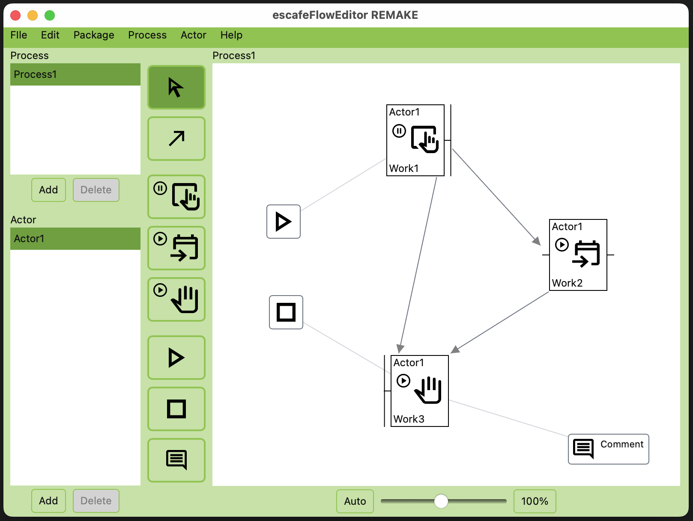

# escafeFlowEditor REMAKE

This is a remake of [escafeFlowEditor](https://github.com/ryoma100/escafeFlowEditor) created with adobe flash and remade with Solid.js.



- [Web Application](https://escafe-flow-editor-remake.pages.dev/editor/)
- [PC Installer](https://github.com/ryoma100/escafeFlowEditor-REMAKE/releases)
- [Storybook](https://escafe-flow-editor-remake.pages.dev/storybook-static/)

## Development

### Tauri + Solid + Typescript

This template should help get you started developing with Tauri, Solid and Typescript in Vite.

### Setup

```
pnpm install
```

- for Web Browser

```
pnpm dev
```

- for PC Application

```
pnpm tauri dev
```

## Build

- for Web Browser

```
pnpm build
pnpm serve
```

- for PC Application

```
pnpm tauri build
```

## Recommended IDE Setup

- [VS Code](https://code.visualstudio.com/) + [Tauri](https://marketplace.visualstudio.com/items?itemName=tauri-apps.tauri-vscode) + [rust-analyzer](https://marketplace.visualstudio.com/items?itemName=rust-lang.rust-analyzer)
